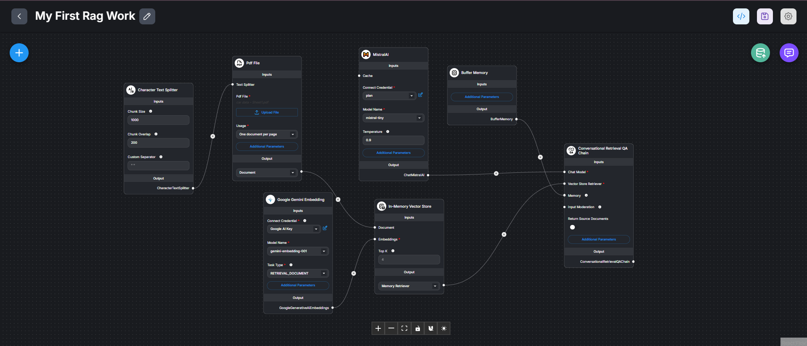
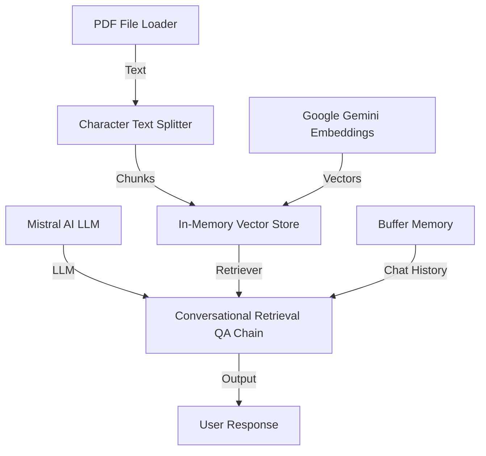

# My First RAG Work - Flowise Chatflow

This project demonstrates my first implementation of a **Retrieval-Augmented Generation (RAG)** system using [Flowise](https://flowiseai.com/). The system allows users to upload PDF documents and have a conversational Q&A experience based on the document's content, powered by state-of-the-art AI models.

## 🏗️ Architecture Overview

The chatflow is built using a modular approach, connecting document loaders, text splitters, embeddings, and large language models into a cohesive retrieval chain.

## 🛠️ Key Components

### 1. **Large Language Model (LLM)**
*   **Model:** `Mistral AI (mistral-tiny)`
*   **Role:** Responsible for generating human-like responses based on the retrieved context.
*   **Configuration:** Temperature set to `0.9` for balanced creativity and accuracy.

### 2. **Embeddings & Vector Store**
*   **Embedding Model:** `Google Gemini (gemini-embedding-001)`
*   **Vector Store:** `In-Memory Vector Store`
*   **Role:** Converts text chunks into numerical vectors and stores them for efficient similarity searching.

### 3. **Document Processing**
*   **Loader:** `PDF File Loader` - Extracts text from uploaded PDF files.
*   **Splitter:** `Character Text Splitter`
    *   **Chunk Size:** 1000 characters
    *   **Chunk Overlap:** 200 characters
    *   **Role:** Breaks down long documents into smaller, manageable pieces to fit LLM context windows.

### 4. **Chain & Memory**
*   **Chain Type:** `Conversational Retrieval QA Chain`
*   **Memory:** `Buffer Memory` (Key: `chat_history`)
*   **Role:** Orchestrates the retrieval process and ensures the AI remembers previous questions in the conversation.

## 🧠 Custom Prompts

The system is configured with specific instructions to act as a focused assistant:
*   **Identity:** "AI Assistant"
*   **Constraint:** Only answers based on the provided document context.
*   **Fallback:** If no relevant information is found, it responds with "Hmm, I'm not sure."

## 🚀 How to Use

1.  **Install Flowise:** Ensure you have Flowise running locally or via Docker.
2.  **Import:** Download the `My First Rag Work Chatflow.json` file.
3.  **Upload:** Go to your Flowise dashboard, click **Add New** -> **Import Chatflow**, and select the JSON file.
4.  **Configure API Keys:**
    *   Provide your `Google Generative AI` API Key for embeddings.
    *   Provide your `Mistral AI` API Key for the LLM.
5.  **Chat:** Upload a PDF in the chat interface and start asking questions!

---
*Created as part of my "AI in Practice" course journey.*
